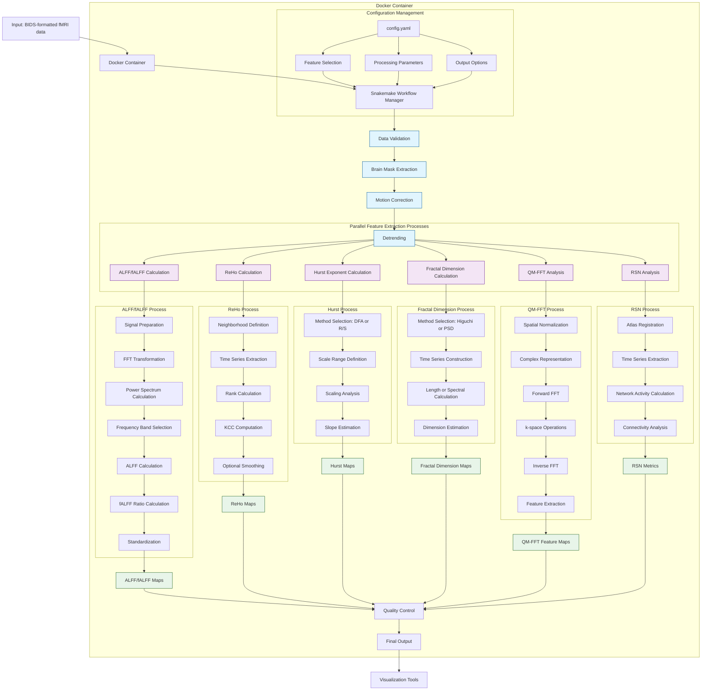

# Technical Details: Core fMRI Feature Extraction Methods

This document provides detailed technical information about the core analytical features extracted by the fMRI Feature Extraction Container pipeline.

*For advanced features (RSN Analysis) and integrative approaches, please see [Advanced Technical Details](TECHNICAL_DETAILS_ADVANCED.md).*

## Table of Contents

1. [Pipeline Architecture and Workflow](#pipeline-architecture-and-workflow)
2. [Amplitude of Low Frequency Fluctuations (ALFF)](#alff)
3. [Fractional Amplitude of Low Frequency Fluctuations (fALFF)](#falff)
4. [Regional Homogeneity (ReHo)](#reho)
5. [Hurst Exponent](#hurst)
6. [Fractal Dimension](#fd)
7. [Quantum Mechanics-Derived Fourier Transform (QM-FFT)](#qmfft)

## Pipeline Architecture and Workflow

The following diagram illustrates the detailed architecture and workflow of the fMRI Feature Extraction Container, showing the processing steps for each analytical feature:



This diagram illustrates the complete workflow, from data input through preprocessing, parallel feature extraction, and output generation. The pipeline is highly modular, allowing users to select which features to extract based on their research needs. Each feature extraction process follows its own specialized workflow, as detailed in the subsequent sections of this document.

<a name="alff"></a>
## 2. Amplitude of Low Frequency Fluctuations (ALFF)

### Theoretical Background

ALFF quantifies the amplitude of spontaneous low-frequency oscillations (typically 0.01-0.08 Hz) in the BOLD signal, providing a measure of regional spontaneous brain activity. It was first proposed by Zang et al. (2007) as a metric for characterizing the local intensity of spontaneous fluctuations in the resting brain.

The neurobiological basis of these low-frequency oscillations remains an active area of research, but they are believed to reflect a combination of:
- Slow fluctuations in neuronal activity
- Neurovascular coupling mechanisms
- Metabolic processes that support ongoing neural activity
- Intrinsic network dynamics that maintain baseline brain function

These low-frequency oscillations are of particular interest because they:
1. Are relatively distinct from higher-frequency physiological noise (cardiac, respiratory)
2. Appear to correlate with electrophysiological measures of neural activity
3. Show consistent spatial patterns that align with known functional systems
4. Demonstrate alterations in various neurological and psychiatric conditions

### Calculation Method

The ALFF computation follows these detailed steps:

1. **Signal Preparation**:
   - Extract the time series data for each voxel within the brain mask
   - Apply signal detrending to remove linear or constant trends
   - (Optional) Apply a band-pass filter to further isolate frequencies of interest

2. **Frequency Domain Transformation**:
   - Convert the time-domain BOLD signal to the frequency domain using Fast Fourier Transform (FFT)
   - The FFT is applied to each voxel's time series independently
   
3. **Power Spectrum Calculation**:
   - Compute the power spectrum as the square of the absolute value of the FFT result
   - Calculate the square root to obtain amplitude values (ALFF is based on amplitude, not power)
   
4. **Frequency Band Selection**:
   - Extract the amplitudes within the low-frequency range (0.01-0.08 Hz)
   - The specific frequency range can be customized via configuration parameters
   
5. **ALFF Computation**:
   - Calculate the sum of amplitudes within the selected frequency band for each voxel
   
6. **Standardization (Optional)**:
   - Apply normalization methods such as Z-score or percent change transformation
   - This facilitates comparisons across subjects or groups

Mathematically, for a time series x(t) with N time points, ALFF is defined as:

```
X(f) = FFT(x(t))
P(f) = |X(f)|²
A(f) = √P(f)
ALFF = ∑ A(f) for f ∈ [0.01, 0.08] Hz
```

Where:
- X(f) is the Fourier transform of x(t)
- P(f) is the power spectrum
- A(f) is the amplitude spectrum
- The summation is over frequencies in the range 0.01-0.08 Hz

For Z-score normalization, the standardized ALFF is computed as:

```
ALFF_z = (ALFF - μ_ALFF) / σ_ALFF
```

Where μ_ALFF and σ_ALFF are the mean and standard deviation of ALFF values across all voxels within the brain mask.

### Implementation Details

In this pipeline, the ALFF calculation is implemented using:

1. **Preprocessing Steps**:
   - Signal extraction using NiBabel and NumPy
   - Signal detrending using SciPy's `detrend` function
   - (Optional) Bandpass filtering using SciPy's `butter` filter with zero-phase filtering

2. **FFT Implementation**:
   - NumPy's `fft.rfft` function for computational efficiency
   - Return only the positive frequencies since the input signal is real

3. **Frequency Selection**:
   - The frequency bins corresponding to the low-frequency range are identified based on the sampling rate (1/TR)
   - For a typical TR of 2 seconds, the Nyquist frequency is 0.25 Hz, and the frequency resolution is 1/(N*TR) Hz per bin

4. **Output Generation**:
   - The results are saved as NIfTI files with the same dimensions and header information as the input data
   - These files can be directly used in standard neuroimaging software for visualization and further analysis

### Interpretation

Higher ALFF values suggest stronger spontaneous activity in a brain region. The interpretation of ALFF should consider several factors:

1. **Regional Variations**:
   - ALFF typically shows higher values in gray matter than white matter
   - Certain regions, including the default mode network (DMN), show consistently higher ALFF in healthy subjects
   - Primary sensory and motor areas often show moderately high ALFF values

2. **Physiological Considerations**:
   - ALFF is sensitive to physiological noise, particularly in blood vessels, ventricles, and cisterns
   - Areas near large vessels may show artificially elevated ALFF values
   - Respiratory and cardiac artifacts can influence ALFF measures despite filtering

3. **Clinical Significance**:
   - Altered ALFF has been reported in numerous neurological and psychiatric conditions
   - Both increases and decreases in ALFF can be clinically relevant, depending on the condition and brain region

4. **Developmental Effects**:
   - ALFF shows age-related changes throughout the lifespan
   - Different developmental trajectories are observed in different brain regions

ALFF has been widely used to detect abnormal brain activity in various disorders, including:

- **Alzheimer's Disease and Dementia**:
  - Decreased ALFF in the posterior cingulate cortex, precuneus, and hippocampus
  - These reductions correlate with cognitive impairment severity
  - Early changes in ALFF may precede structural atrophy

- **Major Depression**:
  - Altered ALFF in limbic and prefrontal regions
  - Decreased ALFF in dorsolateral prefrontal cortex
  - Increased ALFF in subgenual anterior cingulate cortex
  - Changes may normalize with successful treatment

- **Schizophrenia**:
  - Complex pattern of ALFF alterations
  - Decreased ALFF in frontal and temporal regions
  - Increased ALFF in striatal areas
  - Correlations with negative symptom severity and cognitive impairment

- **Attention Deficit Hyperactivity Disorder (ADHD)**:
  - Decreased ALFF in frontal-striatal circuits
  - Alterations in posterior midline components of the default mode network
  - ALFF changes correlate with symptom severity and may predict treatment response

- **Parkinson's Disease**:
  - Reduced ALFF in the motor network and striatum
  - Alterations correlate with motor symptom severity
  - Progressive changes with disease progression

### Configuration Options

In this pipeline, ALFF calculation can be customized with the following parameters:

- `alff_bandpass_low`: Lower frequency bound (default: 0.01 Hz)
  - Typical range: 0.01-0.03 Hz
  - Lower values may include more physiological noise
  - Higher values may exclude meaningful neural oscillations
  
- `alff_bandpass_high`: Upper frequency bound (default: 0.08 Hz)
  - Typical range: 0.08-0.1 Hz
  - Higher values may include respiratory artifacts
  - Lower values may exclude relevant neural signals
  
- `detrend_method`: Method for detrending the signal (options: "linear", "constant", or "none")
  - "linear": Removes linear trends (recommended for most analyses)
  - "constant": Removes only the mean (DC component)
  - "none": No detrending applied (not recommended for ALFF)
  
- `normalize_method`: Method for normalizing ALFF values (options: "zscore", "percent", or "none")
  - "zscore": Standardizes values using mean and standard deviation (facilitates group comparisons)
  - "percent": Expresses values as percentage of mean (useful for visualization)
  - "none": No normalization applied (raw values retained)

### Advantages and Limitations

**Advantages**:
- Relatively simple to compute and interpret
- Sensitive to regional differences in spontaneous brain activity
- Well-established metric with extensive literature support
- Provides complementary information to functional connectivity measures

**Limitations**:
- Sensitive to physiological noise from blood vessels and CSF pulsation
- Cannot distinguish between neural and non-neural sources of low-frequency oscillations
- Spatial specificity may be limited by vascular artifacts
- Limited temporal information (does not capture dynamics or connectivity)

<a name="falff"></a>
## 3. Fractional Amplitude of Low Frequency Fluctuations (fALFF)

### Theoretical Background

fALFF, introduced by Zou et al. (2008), addresses some limitations of ALFF by measuring the ratio of power in the low-frequency range relative to the entire frequency range. This normalization reduces sensitivity to physiological noise and improves specificity for neural signal detection.

While ALFF quantifies the absolute strength of low-frequency oscillations, fALFF represents the relative contribution of low-frequency components to the entire frequency spectrum. The key theoretical advantages of fALFF include:

1. **Physiological Noise Suppression**: By calculating a ratio rather than absolute amplitude, fALFF reduces the impact of non-specific physiological noise that affects all frequency bands
2. **Spatial Specificity**: fALFF shows greater gray-white matter contrast than ALFF
3. **Inter-subject Variability Reduction**: The ratio calculation inherently normalizes for overall amplitude differences between individuals
4. **Scanner and Sequence Robustness**: fALFF may be less sensitive to scanner-specific artifacts and pulse sequence variations

The neurobiological interpretation of fALFF centers on the concept that neural activity has specific frequency signatures that differ from non-neural sources. Higher fALFF values suggest that a greater proportion of a region's oscillatory activity is in the frequency range thought to be most relevant for neural communication and network coordination.

### Calculation Method

The fALFF computation follows these detailed steps:

1. **Signal Preparation**:
   - Extract the time series data for each voxel within the brain mask
   - Apply signal detrending to remove linear or constant trends
   - (Optional but not recommended for fALFF) Apply a band-pass filter

2. **Frequency Domain Transformation**:
   - Convert the time-domain BOLD signal to the frequency domain using Fast Fourier Transform (FFT)
   - The FFT is computed independently for each voxel's time series
   
3. **Amplitude Spectrum Calculation**:
   - Compute the power spectrum by squaring the absolute value of the FFT result
   - Calculate the square root to obtain amplitude values
   
4. **Low-Frequency Band Summing**:
   - Sum the amplitudes within the low-frequency range (0.01-0.08 Hz)
   - This sum represents the numerator of the fALFF ratio
   
5. **Total Frequency Range Summing**:
   - Sum the amplitudes across the entire frequency range (0 to Nyquist frequency)
   - This sum represents the denominator of the fALFF ratio
   
6. **Ratio Calculation**:
   - Compute the ratio of the low-frequency amplitude sum to the total amplitude sum
   - This ratio is the fALFF value

Mathematically, for a time series x(t), fALFF is defined as:

```
X(f) = FFT(x(t))
P(f) = |X(f)|²
A(f) = √P(f)
fALFF = ∑A(f) for f ∈ [0.01, 0.08] Hz / ∑A(f) for all frequencies
```

Where:
- X(f) is the Fourier transform of x(t)
- P(f) is the power spectrum
- A(f) is the amplitude spectrum
- The numerator sums amplitudes in the 0.01-0.08 Hz range
- The denominator sums amplitudes across all available frequencies

Some implementations exclude the 0 Hz component (DC component) from the denominator sum, as this represents the signal mean rather than fluctuations.

### Implementation Details

In this pipeline, the fALFF calculation is implemented using:

1. **Preprocessing**:
   - Same preprocessing steps as ALFF for signal extraction and detrending
   - Carefully avoids frequency filtering before FFT computation (which would bias the fALFF ratio)

2. **Frequency Range Definition**:
   - Low-frequency range (numerator): Typically 0.01-0.08 Hz
   - Total range (denominator): 0 to Nyquist frequency (which equals 1/(2*TR))
   - For a typical TR of 2 seconds, the Nyquist frequency is 0.25 Hz

3. **Handling Zero Division**:
   - Checks for zero values in the denominator to avoid division by zero
   - Voxels with zero total power (which should be extremely rare in real data) are assigned a fALFF value of zero

4. **Output Generation**:
   - Results are saved as NIfTI files with the same dimensions and header information as the input data
   - fALFF values are typically between 0 and 1, representing the fraction of power in the low-frequency band

### Interpretation

fALFF represents the relative contribution of low-frequency oscillations to the entire detectable frequency range. Higher fALFF values indicate that low-frequency oscillations contribute more to the total frequency spectrum, often interpreted as more organized neural activity.

Key interpretive aspects include:

1. **Physiological Significance**:
   - Higher fALFF values suggest a greater proportion of a region's activity is in the frequency range associated with neural signaling
   - Lower values may indicate more broadband or high-frequency activity, which can reflect various neurophysiological states
   - Changes in fALFF could reflect alterations in the underlying oscillatory dynamics of neural populations

2. **Normal Distribution**:
   - In healthy subjects, fALFF is highest in regions associated with the default mode network
   - Primary sensory and motor cortices typically show intermediate fALFF values
   - White matter regions generally show lower fALFF compared to gray matter
   - This pattern differs from ALFF, which often shows high values near large vessels

3. **Comparison with ALFF**:
   - fALFF typically shows better specificity for gray matter
   - fALFF is less sensitive to physiological artifacts in areas adjacent to vessels and ventricles
   - ALFF may be more sensitive to absolute changes in low-frequency power, while fALFF better detects relative spectral shifts
   - Some studies suggest combining both metrics provides complementary information

4. **Clinical Applications**:
   - **Major Depression**: Altered fALFF in frontolimbic circuits, particularly in the anterior cingulate and amygdala
   - **Schizophrenia**: Decreased fALFF in frontotemporal regions and altered fALFF in default mode network
   - **Alzheimer's Disease**: Reduced fALFF in posterior components of the default mode network
   - **Autism Spectrum Disorder**: Complex patterns of fALFF alterations in social cognition networks
   - **Epilepsy**: Increased fALFF in epileptogenic regions and connected networks

5. **Treatment Effects**:
   - fALFF changes have been reported following various interventions:
     - Pharmaceutical treatments (e.g., antidepressants)
     - Cognitive and behavioral therapies
     - Neurostimulation approaches (e.g., TMS, tDCS)
     - Neurofeedback training

### Configuration Options

fALFF shares configuration options with ALFF but adds one unique parameter:

- `compute_falff`: Boolean to enable/disable fALFF computation (default: true)
  - When enabled, fALFF is computed alongside ALFF
  - Disabling this option can reduce computation time if only ALFF is needed

Other relevant parameters include:

- `alff_bandpass_low`: Lower frequency bound for the numerator (default: 0.01 Hz)
- `alff_bandpass_high`: Upper frequency bound for the numerator (default: 0.08 Hz)
- `detrend_method`: Method for detrending the signal (used for both ALFF and fALFF)
- `normalize_method`: Method for normalizing the final fALFF values

### Advantages and Limitations

**Advantages**:
- More specific to neural activity than ALFF
- Less sensitive to physiological noise and artifacts
- Better gray-white matter contrast
- Normalizes for individual differences in overall signal amplitude
- More robust across different scanning parameters

**Limitations**:
- As a ratio measure, may be less sensitive to absolute changes in low-frequency power
- Still affected by head motion and other artifacts
- Interpretation can be complicated in regions with very low overall power
- The optimal frequency range may vary across brain regions and conditions
- Like ALFF, provides limited information about connectivity or network dynamics

<a name="reho"></a>
## 4. Regional Homogeneity (ReHo)

### Theoretical Background

Regional Homogeneity (ReHo), introduced by Zang et al. (2004), measures the similarity or synchronization of the time series of a given voxel to those of its nearest neighbors. It evaluates local synchronization of spontaneous brain activity, based on the assumption that brain activity occurs in clusters rather than in isolated voxels.

The theoretical foundation of ReHo rests on several neurobiological principles:

1. **Functional Integration**: Neurons within a local region typically work together as functional units
2. **Spatial Coherence**: Neural assemblies tend to activate and deactivate in synchrony with neighboring assemblies
3. **Vascular Supply**: Local regions share common blood supply, leading to similar hemodynamic responses
4. **Anatomical Connectivity**: Short-range connections are more numerous than long-range connections

Unlike ALFF and fALFF, which characterize the spectral properties of individual voxels, ReHo captures the spatial coherence of the BOLD signal fluctuations. This makes ReHo a unique measure of local functional organization that complements spectral and connectivity-based analyses.

The neurobiological significance of ReHo lies in its ability to detect the local coordination of neural activity. Higher ReHo suggests stronger local synchronization, which may reflect:
- More efficient local information processing
- Greater functional specialization
- Enhanced short-range connectivity
- Greater metabolic coherence

### Calculation Method

ReHo is calculated using Kendall's coefficient of concordance (KCC) to measure the similarity among time series of neighboring voxels. This non-parametric approach is robust to outliers and does not assume a particular distribution of the data.

The detailed calculation proceeds as follows:

1. **Voxel Selection**:
   - For each voxel in the brain mask, identify its K nearest neighboring voxels
   - Common neighborhood definitions include:
     - 6 neighbors (face-adjacent voxels)
     - 18 neighbors (face- and edge-adjacent voxels)
     - 26 neighbors (face-, edge-, and corner-adjacent voxels)

2. **Time Series Extraction**:
   - Extract the time series for the center voxel and all its neighbors
   - This results in K+1 time series (the center voxel plus K neighbors)

3. **Rank Calculation**:
   - For each time point, rank the signal intensity across the K+1 voxels
   - This converts the absolute signal values to relative rankings
   - Ties are assigned the average rank of the tied values

4. **Sum of Ranks**:
   - For each time point, compute the sum of ranks across the K+1 voxels
   - Let Ri denote the sum of ranks at the ith time point

5. **Kendall's Coefficient of Concordance (KCC) Calculation**:
   - Compute the KCC using the formula:
   
   ```
   W = (∑(Ri - R̄)²) / ((1/12) × K² × (n³-n))
   ```
   
   Where:
   - W is the KCC value (representing ReHo)
   - Ri is the sum rank of the ith time point
   - R̄ is the mean of the Ri values
   - n is the number of time points
   - K is the number of neighbors (excluding the center voxel)

The formula can also be written as:

```
W = (∑(Ri)² - n(R̄)²) / ((1/12) × K² × (n³-n))
```

This simplified formulation is mathematically equivalent and sometimes computationally more efficient.

### Implementation Details

In this pipeline, ReHo calculation is implemented using the AFNI software package, particularly the `3dReHo` command. The implementation includes:

1. **Preprocessing**:
   - Standard preprocessing including motion correction and spatial normalization
   - (Optional but recommended) Low-pass filtering to focus on frequencies below 0.08 Hz
   - (Optional) Nuisance regression to remove confounding signals
   - No spatial smoothing before ReHo calculation (to preserve local spatial information)

2. **Neighborhood Definition**:
   - Default setting uses a 27-voxel neighborhood (3×3×3 cube, corresponding to 26 neighbors plus the center voxel)
   - Alternative neighborhood sizes (7 or 19) can be selected via configuration options

3. **Boundary Handling**:
   - Voxels near the edge of the brain mask have fewer valid neighbors
   - The implementation either excludes these voxels or computes ReHo with the available valid neighbors
   - A minimum number of valid neighbors can be enforced to ensure reliable estimates

4. **Post-Processing**:
   - Output maps are often spatially smoothed to improve signal-to-noise ratio (after ReHo calculation)
   - Z-score normalization may be applied to facilitate group comparisons

5. **Output Generation**:
   - Results are saved as a NIfTI file with the same dimensions as the input data
   - ReHo values typically range from 0 to 1, with higher values indicating greater local synchronization

### Interpretation

Higher ReHo values indicate greater local synchronization of spontaneous brain activity, suggesting more coordinated function among neighboring neurons. The interpretation of ReHo should consider several key aspects:

1. **Normal Patterns**:
   - ReHo is typically higher in gray matter than white matter
   - Certain regions, particularly those involved in primary sensory processing and default mode function, show consistently high ReHo in healthy subjects
   - There are reliable developmental patterns, with ReHo changing throughout the lifespan

2. **Neurobiological Significance**:
   - High ReHo may indicate efficient local information processing
   - Low ReHo might suggest reduced functional integration
   - Changes in ReHo could reflect alterations in local circuit properties, neurovascular coupling, or neurotransmitter systems

3. **Clinical Applications**:
   - **Parkinson's Disease**: 
     - Decreased ReHo in motor cortex and basal ganglia
     - Progressive reduction with disease severity
     - Patterns differ between tremor-dominant and akinetic-rigid subtypes
   
   - **Depression**:
     - Reduced ReHo in prefrontal regions
     - Increased ReHo in limbic areas
     - Treatment normalizes ReHo alterations in responders
   
   - **Autism Spectrum Disorders**:
     - Complex pattern of ReHo alterations
     - Often decreased in social cognition networks
     - May show developmental abnormalities in ReHo maturation
   
   - **Epilepsy**:
     - Increased ReHo in epileptogenic zones
     - Altered ReHo in functionally connected regions
     - Potential biomarker for seizure focus localization
   
   - **Alzheimer's Disease**:
     - Decreased ReHo in hippocampus and default mode network regions
     - Progressive decrease with disease progression
     - Early changes may predict conversion from mild cognitive impairment

4. **Relationship to Other Measures**:
   - ReHo can be viewed as a measure of local functional connectivity
   - Alterations in ReHo often occur in regions that show abnormal ALFF/fALFF
   - Regions with high ReHo often serve as hubs in larger-scale functional networks
   - The relationship between ReHo and structural measures (e.g., gray matter volume, cortical thickness) provides insight into structure-function relationships

### Advanced Variations and Extensions

Several methodological extensions have been developed to enhance ReHo analysis:

1. **Frequency-specific ReHo**: Calculating ReHo after bandpass filtering to examine synchronization in specific frequency bands

2. **Long-range ReHo**: Adapting the methodology to assess synchronization among non-adjacent voxels

3. **Surface-based ReHo**: Computing ReHo on cortical surface meshes rather than in volumetric space, which may better respect anatomical boundaries

4. **Dynamic ReHo**: Calculating ReHo in sliding time windows to capture temporal variations in local synchronization

5. **Multivariate ReHo**: Extending the concept to assess synchronization patterns across multiple parameters simultaneously

### Configuration Options

In this pipeline, ReHo calculation can be customized with:

- `reho_neighborhood`: Number of voxels to include in the neighborhood calculation
  - 7: Only face-adjacent voxels (6 neighbors plus center)
  - 19: Face- and edge-adjacent voxels (18 neighbors plus center)
  - 27: Full 3×3×3 cubic neighborhood (26 neighbors plus center, default)

- `apply_smoothing`: Boolean indicating whether to apply spatial smoothing after ReHo calculation
  - Smoothing after ReHo calculation can improve SNR but reduces spatial specificity

- `smoothing_fwhm`: Full-width at half-maximum for the Gaussian smoothing kernel (in mm)
  - Typical values range from 4-8mm

### Advantages and Limitations

**Advantages**:
- Measures a unique aspect of brain function (local synchronization) not captured by other metrics
- Non-parametric approach is robust to outliers and non-normal distributions
- Does not require a priori definition of regions of interest
- Sensitive to subtle functional alterations in various conditions
- Computationally efficient and straightforward to implement

**Limitations**:
- Sensitive to preprocessing choices, particularly head motion correction
- Limited to examining local synchronization, missing long-range connectivity
- Affected by partial volume effects, especially at gray/white matter boundaries
- Interpretation can be challenging in regions with complex anatomical organization
- Optimal neighborhood size may vary across brain regions and research questions
- Like other resting-state measures, does not directly assess task-related functional engagement

<a name="hurst"></a>
## 5. Hurst Exponent

### Theoretical Background

The Hurst exponent (H), named after Harold Edwin Hurst, quantifies the long-range temporal dependence or autocorrelation in the fMRI time series. It measures the predictability or persistence of the signal over time, providing a window into the temporal dynamics of brain activity that complements spatial and spectral analyses.

The concept of the Hurst exponent originated in hydrology when studying long-term storage capacity of reservoirs along the Nile River. In neuroscience, it has been adapted to characterize the self-similarity and long-memory dependencies in brain signals. The theoretical foundations of the Hurst exponent in brain dynamics include:

1. **Scale-Invariance**: Brain activity shows similar statistical properties across different time scales, a hallmark of complex systems
2. **Long-Range Dependencies**: Current brain states are influenced by prior states over extended time periods
3. **Fractal Dynamics**: Brain activity exhibits fractal-like temporal patterns with self-similar structure
4. **Criticality**: The brain may operate near critical states characterized by specific scaling properties

From a neurobiological perspective, the Hurst exponent may reflect:
- The balance between excitation and inhibition in neural circuits
- The temporal integration properties of neural populations
- The presence of memory effects in neural dynamics
- The capacity for neural systems to maintain states over time
- The intrinsic stability or variability of neural networks

### Mathematical Foundation

The Hurst exponent is related to the concept of fractional Brownian motion (fBm), a generalization of Brownian motion where increments need not be independent. For a process BH(t) with Hurst exponent H, the variance of increments scales as:

```
E[|BH(t2) - BH(t1)|²] ∝ |t2 - t1|^(2H)
```

This scaling relationship is the fundamental property characterized by the Hurst exponent.

### Calculation Methods

This pipeline implements two main methods for calculating the Hurst exponent:

1. **Detrended Fluctuation Analysis (DFA)**:

   DFA is a method designed to measure long-range correlations in non-stationary time series, making it particularly suitable for fMRI data.
   
   The detailed steps include:
   
   a. **Integration**: Convert the original time series x(i) to a cumulative sum series y(k):
      ```
      y(k) = ∑[x(i) - x̄] for i = 1 to k
      ```
      where x̄ is the mean of x(i)
   
   b. **Segmentation**: Divide the integrated time series y(k) into non-overlapping segments of length n
   
   c. **Local Trend Estimation**: For each segment, fit a polynomial trend (typically linear) using least squares
   
   d. **Detrending**: Subtract the local trend from the integrated series to obtain the detrended fluctuation
   
   e. **Fluctuation Calculation**: Calculate the root mean square fluctuation F(n) for segments of length n:
      ```
      F(n) = √[(1/N) ∑[y(k) - yn(k)]²]
      ```
      where yn(k) is the local trend in the segment containing k, and N is the total length of the series
   
   f. **Scaling Analysis**: Repeat steps b-e for different segment lengths n
   
   g. **Hurst Exponent Estimation**: Plot log(F(n)) against log(n) and estimate H as the slope of this relationship:
      ```
      F(n) ∝ n^H
      ```

2. **Rescaled Range Analysis (R/S)**:

   R/S analysis is the classical method introduced by Hurst himself, based on the scaling properties of the range of cumulative deviations normalized by local standard deviation.
   
   The detailed steps include:
   
   a. **Division**: Divide the time series of length N into A non-overlapping segments of length n (N = A×n)
   
   b. **For each segment**:
      - Calculate the mean m and standard deviation s
      - Create a mean-adjusted series: Y(i) = X(i) - m for i = 1 to n
      - Create a cumulative deviate series: Z(i) = ∑Y(j) for j = 1 to i
      - Calculate the range R = max(Z) - min(Z)
      - Calculate the rescaled range R/S for the segment
   
   c. **Averaging**: Calculate the average rescaled range (R/S)n across all segments of length n
   
   d. **Repeat**: Repeat steps a-c for different values of n
   
   e. **Hurst Exponent Estimation**: Plot log((R/S)n) against log(n) and estimate H as the slope:
      ```
      (R/S)n ∝ n^H
      ```

### Implementation Details

In this pipeline, the Hurst exponent calculation is implemented with several technical considerations:

1. **Preprocessing**:
   - Signal extraction and basic preprocessing (motion correction, detrending)
   - (Optional) Low-pass filtering to focus on the frequency range of interest
   - No spatial smoothing before Hurst exponent calculation (to preserve local temporal dynamics)

2. **DFA Implementation**:
   - Uses a linear detrending approach (DFA-1)
   - Segment lengths are chosen to span a range from short to long intervals (typically 4 to N/4)
   - Segments are logarithmically spaced to ensure even distribution on log-log plots
   - Minimum 4 points required on the log-log plot for reliable slope estimation

3. **R/S Implementation**:
   - Implements classical R/S analysis with multiple segment lengths
   - Handles edge effects by ensuring sufficient samples at all scales
   - Employs robust regression techniques to estimate the scaling exponent

4. **Statistical Robustness**:
   - Confidence intervals for H are estimated using bootstrapping
   - Goodness-of-fit for the scaling relationship is quantified
   - Assessment of stationarity to validate the application of these methods

5. **Output Generation**:
   - Results are saved as a NIfTI file with the same dimensions as the input data
   - Additional diagnostic plots may be generated for quality control

### Interpretation

The Hurst exponent (H) typically falls in the range of 0 to 1, though values outside this range are theoretically possible in certain contexts:

- **H = 0.5**: Random walk (Brownian motion) - no long-range correlations
  - Future increments are statistically independent of past increments
  - Represents a complete lack of memory in the system
  - In fMRI, may indicate random, unpredictable activity

- **0 < H < 0.5**: Anti-persistent behavior (negatively correlated)
  - Increases tend to be followed by decreases and vice versa
  - System shows a tendency to reverse direction
  - Exhibits more switching and less trend-following than random walks
  - In fMRI, may indicate regulatory or compensatory processes

- **0.5 < H < 1**: Persistent behavior (positively correlated)
  - Increases tend to be followed by increases, decreases by decreases
  - System shows trends and momentum
  - Exhibits "long memory" with correlations decaying slowly
  - In fMRI, may indicate structured, predictable brain activity

- **H = 1**: Perfect correlation (deterministic trend)
  - Perfect positive correlation between increments
  - Represents a system with perfect memory

- **H > 1**: Super-persistent behavior
  - Rarely observed in natural systems
  - May indicate non-stationarity or particular forms of multi-fractality

In the context of fMRI and brain dynamics:

1. **Healthy Brain Function**:
   - Most brain regions show H values in the range of 0.5 to 0.9
   - Default mode network regions often show high H values (strong persistence)
   - Primary sensory areas may show lower H values (more immediate responsiveness)
   - White matter typically shows higher H values than gray matter
   - There are consistent developmental patterns, with H changing throughout the lifespan

2. **Clinical Applications**:
   - **Alzheimer's Disease**:
     - Altered H values in default mode network regions
     - Changes may precede structural alterations
     - Potential biomarker for early detection
   
   - **Schizophrenia**:
     - Decreased persistence (lower H) in prefrontal regions
     - Altered scaling behavior in sensory processing areas
     - Correlations with specific symptom dimensions
   
   - **Epilepsy**:
     - Increased persistence (higher H) in epileptogenic zones
     - Changes in H before, during, and after seizures
     - Potential for seizure prediction and focus localization
   
   - **Depression**:
     - Altered persistence in emotional regulation circuits
     - Treatment responsive changes in H values
     - Correlations with rumination and cognitive processes
   
   - **Aging**:
     - Progressive changes in H across the lifespan
     - Alterations in the balance between persistence and anti-persistence
     - Associations with cognitive performance

3. **Neurobiological Interpretation**:
   - H may reflect the capacity of neural systems to maintain states over time
   - Low H (anti-persistence) might indicate greater adaptability but less stability
   - High H (persistence) might indicate greater stability but less adaptability
   - The optimal range may depend on the specific function of a brain region
   - H can be influenced by neurotransmitter systems, with modulatory neurotransmitters like dopamine affecting temporal scaling properties

4. **Relationship to Other Measures**:
   - Relationships with complexity measures like entropy and fractal dimension
   - Associations with functional connectivity metrics
   - Complementarity with frequency-based analyses (ALFF, fALFF)
   - Correlations with graph-theoretical network properties

### Advanced Variations and Extensions

Several methodological extensions have been developed to enhance Hurst exponent analysis:

1. **Multifractal DFA**: Extends DFA to characterize signals with multiple scaling exponents that depend on fluctuation magnitude

2. **Wavelet-based estimators**: Use wavelet decomposition to estimate H, offering advantages for non-stationary signals

3. **Local Hurst exponent**: Calculate H in sliding windows to examine dynamic changes in persistence

4. **Frequency-specific H**: Estimate scaling properties in specific frequency bands

5. **Cross-correlation scaling**: Extend to characterize long-range dependencies between two time series (similar to functional connectivity but focusing on scaling properties)

### Configuration Options

In this pipeline, Hurst exponent calculation can be customized with:

- `compute_hurst`: Boolean to enable/disable calculation (default: true)

- `hurst_method`: Method for calculation (options: "dfa" or "rs")
  - "dfa": Detrended Fluctuation Analysis (recommended for most fMRI applications)
  - "rs": Rescaled Range Analysis (classical approach, less robust to non-stationarity)

- `dfa_order`: Order of polynomial detrending in DFA (default: 1)
  - 1: Linear detrending (DFA-1)
  - 2: Quadratic detrending (DFA-2)
  - Higher orders remove more complex trends but require longer time series

- `min_scale`: Minimum window size for scaling analysis (default: 4)
  - Must be ≥ 4 for reliable local trend estimation
  - Should be adjusted based on sampling rate and expected minimum timescale of interest

- `max_scale`: Maximum window size for scaling analysis (default: N/4)
  - N is the length of the time series
  - Should not exceed N/4 to ensure sufficient windows for averaging

### Advantages and Limitations

**Advantages**:
- Captures long-range temporal dependencies not visible in spectral or connectivity analyses
- Provides a single scalar measure that characterizes complex temporal dynamics
- Relatively robust to noise when appropriate estimation methods are used
- Does not require stationarity (especially for DFA)
- Connects brain dynamics to a broader theoretical framework of complex systems

**Limitations**:
- Requires relatively long time series for reliable estimation (ideally >100 time points)
- Sensitive to preprocessing choices, particularly temporal filtering
- Different estimation methods may yield slightly different values
- Limited by the temporal resolution and hemodynamic nature of fMRI
- Cannot distinguish different sources of long-range dependencies
- Interpretation can be challenging given the multiple possible neurobiological mechanisms
- May be affected by head motion and physiological noise

<a name="fd"></a>
## 6. Fractal Dimension

### Theoretical Background

Fractal dimension (FD) is a measure of the complexity and self-similarity of a time series. In fMRI analysis, it quantifies the irregularity or complexity of BOLD signal fluctuations, providing insight into the chaotic or self-similar nature of brain activity.

The concept of fractal dimension has its origins in the mathematics of fractals, structures that show self-similarity across different scales. In neuroscience, fractal analysis has been applied to various signals, from single neuron recordings to macroscale brain activity measured by fMRI. The theoretical foundations include:

1. **Self-Similarity**: Brain activity shows similar patterns across different temporal and spatial scales
2. **Scale-Free Dynamics**: The brain exhibits activity patterns without characteristic scales, a property of many complex systems
3. **Complexity Theory**: Brain function emerges from complex interactions across multiple scales
4. **Non-Linear Dynamics**: Brain activity reflects non-linear processes that can generate complex, fractal-like behavior

The neurobiological significance of fractal dimension includes:
- Reflecting the intrinsic complexity of neural dynamics
- Quantifying the information content or entropy in brain signals
- Capturing the balance between order and randomness in neural activity
- Measuring the "roughness" or irregularity of temporal brain patterns
- Indicating the number of degrees of freedom in the underlying system

### Mathematical Foundation

For time series data, the fractal dimension can be understood as a measure that exceeds the topological dimension (which would be 1 for a line) by an amount related to the complexity or "space-filling" nature of the signal.

In a broad mathematical sense, for a self-similar object, the fractal dimension D is related to the number of self-similar pieces N(ε) when the object is divided into parts of size ε:

```
N(ε) ∝ ε^(-D)
```

Taking the logarithm:

```
D = -lim(ε→0) [log(N(ε)) / log(ε)]
```

For time series data, this concept is adapted to quantify the complexity of the signal's graph.

### Calculation Methods

The pipeline implements two main methods for calculating fractal dimension:

1. **Higuchi Fractal Dimension (HFD)**:

   HFD is particularly well-suited for time series analysis and provides a direct estimate of the fractal dimension.
   
   The detailed steps include:
   
   a. **Construction of New Time Series**: For a given time series X(1), X(2), ..., X(N), construct k new time series Xᵏₘ as:
      ```
      Xᵏₘ = {X(m), X(m+k), X(m+2k), ..., X(m+⌊(N-m)/k⌋·k)}
      ```
      for m = 1, 2, ..., k, where k is the interval and m is the starting point
   
   b. **Length Calculation**: For each time series Xᵏₘ, calculate the normalized length:
      ```
      Lₘ(k) = [∑|X(m+ik) - X(m+(i-1)k)| · (N-1)/⌊(N-m)/k⌋·k] / k
      ```
   
   c. **Average Length**: Calculate the average length L(k) for each interval k:
      ```
      L(k) = (1/k) ∑Lₘ(k) for m = 1 to k
      ```
   
   d. **Scaling Relationship**: If the time series is fractal, then L(k) ∝ k^(-D), where D is the fractal dimension
   
   e. **Dimension Estimation**: Plot log(L(k)) against log(k) and estimate D as the negative of the slope of the linear regression

2. **Power Spectral Density (PSD) method**:

   The PSD method uses the relationship between the power spectral density and frequency in systems with fractal properties.
   
   The detailed steps include:
   
   a. **Power Spectrum Calculation**: Compute the power spectral density S(f) of the time series using Fourier transform
   
   b. **Log-Log Plot**: Plot log(S(f)) against log(f)
   
   c. **Slope Estimation**: For fractal time series, S(f) ∝ f^(-β), where β is the spectral exponent
   
   d. **Dimension Calculation**: The fractal dimension D is related to β by:
      ```
      D = (5-β)/2  for 1 < β < 3
      ```
      
      This relationship is derived from the connection between spectral properties and the Hurst exponent (H = (3-β)/2), with D = 2-H for single-valued functions.

### Implementation Details

In this pipeline, the fractal dimension calculation is implemented with several technical considerations:

1. **Preprocessing**:
   - Signal extraction and basic preprocessing (motion correction, detrending)
   - (Optional) Band-pass filtering to focus on frequencies of interest
   - No spatial smoothing before FD calculation (to preserve local complexity)

2. **Higuchi Implementation**:
   - Uses multiple k values, typically logarithmically spaced between 1 and some maximum (e.g., N/10)
   - Implements robust linear regression for slope estimation
   - Provides goodness-of-fit measures to assess the quality of the fractal scaling

3. **PSD Implementation**:
   - Uses Welch's method for more stable power spectrum estimation
   - Applies windowing (typically Hamming window) to reduce spectral leakage
   - Focuses on the frequency range showing power-law scaling
   - Implements robust fitting methods to reduce sensitivity to noise

4. **Validation Checks**:
   - Linearity assessment in log-log plots to confirm fractal-like scaling
   - Confidence intervals for dimension estimates
   - Statistical tests to distinguish fractal from non-fractal time series

5. **Output Generation**:
   - Results are saved as a NIfTI file with the same dimensions as the input data
   - Values typically range from 1.0 to 2.0, with higher values indicating more complex signals

### Interpretation

Fractal dimension typically ranges from 1 to 2 for time series data, with specific interpretations:

- **FD ≈ 1.0**: Smooth, regular signal with low complexity
  - Highly predictable dynamics
  - Strong autocorrelations
  - Simple underlying processes
  - In fMRI, may indicate highly synchronized, regular neural activity

- **1.0 < FD < 1.5**: Moderately complex signal
  - Mixture of predictable and random components
  - Moderate autocorrelations
  - In fMRI, often seen in healthy gray matter regions

- **FD ≈ 1.5**: Similar to fractional Brownian motion with H=0.5
  - Random walk-like properties
  - No long-range correlations
  - Balance between order and randomness

- **1.5 < FD < 2.0**: Highly complex, irregular signal
  - Less predictable dynamics
  - Weaker autocorrelations
  - Rich, potentially chaotic behavior
  - In fMRI, may indicate complex, dynamic neural activity

- **FD ≈ 2.0**: Extremely rough signal approaching white noise
  - Minimal predictability
  - Essentially independent fluctuations
  - Maximum complexity within the 1D embedding

In the context of fMRI and brain dynamics:

1. **Normal Brain Function**:
   - Healthy gray matter typically shows FD values around 1.2-1.6
   - White matter generally shows lower FD than gray matter
   - Specific regions like prefrontal cortex often show higher complexity
   - Primary sensory areas may show lower complexity
   - There are consistent developmental patterns, with FD changing throughout the lifespan
   - Cognitive tasks may induce transient changes in FD

2. **Clinical Applications**:
   - **Alzheimer's Disease and Dementia**:
     - Reduced complexity (lower FD) in affected regions
     - Progressive decrease with disease advancement
     - Changes may correlate with cognitive impairment
     - Potential early biomarker before structural changes
   
   - **Schizophrenia**:
     - Altered complexity in prefrontal and temporal regions
     - Both increases and decreases reported in different regions
     - Correlations with specific symptom dimensions
     - May reflect disturbances in neural information processing
   
   - **Epilepsy**:
     - Decreased complexity (lower FD) in epileptogenic regions
     - Dynamic changes in FD before, during, and after seizures
     - Potential for seizure prediction models
   
   - **Sleep and Consciousness**:
     - Systematic decreases in FD with deepening sleep stages
     - Reduced complexity in anesthetized states
     - Potential marker for depth of unconsciousness
   
   - **Aging**:
     - Age-related decreases in complexity in specific networks
     - Associations with cognitive performance
     - Different trajectories in healthy versus pathological aging

3. **Psychological and Cognitive Correlates**:
   - Relationships with intelligence and cognitive flexibility
   - Alterations associated with personality traits
   - Changes during meditation and altered states of consciousness
   - Modulations during different emotional states

4. **Relationship to Other Measures**:
   - Complementary information to the Hurst exponent (mathematically related as D ≈ 2-H for fBm)
   - Different sensitivity than spectral measures like ALFF/fALFF
   - Often correlates with entropy-based complexity measures
   - Provides information about signal properties not captured by standard connectivity analyses

### Advanced Variations and Extensions

Several methodological extensions have been developed to enhance fractal dimension analysis:

1. **Multifractal Analysis**: Extends beyond a single scaling exponent to characterize signals with multiple scaling properties dependent on fluctuation magnitude

2. **Wavelet-based Fractal Analysis**: Uses wavelet decomposition to better handle non-stationarity and isolate scaling behavior at different scales

3. **Adaptive Fractal Analysis**: Improves estimation by addressing issues of non-stationarity and trends in the data

4. **Box-counting Dimension**: Alternative approach based on the traditional definition of fractal dimension, adapted for time series

5. **Correlation Dimension**: Based on phase-space reconstruction, provides information about the dimensionality of the underlying attractor

### Configuration Options

In this pipeline, fractal dimension calculation can be customized with:

- `compute_fractal`: Boolean to enable/disable calculation (default: true)

- `fractal_method`: Method for calculation (options: "higuchi" or "psd")
  - "higuchi": Higuchi Fractal Dimension (generally more direct and robust for time series)
  - "psd": Power Spectral Density method (connects to spectral properties)

- `higuchi_kmax`: Maximum k value for Higuchi method (default: N/10)
  - Higher values include more scales but may introduce noise
  - Typical range: N/20 to N/5 depending on time series length

- `psd_freq_range`: Frequency range for power-law fitting in PSD method
  - Default: [0.01, 0.1] Hz
  - Should be adjusted based on the frequency range of interest

- `fit_method`: Method for slope estimation (options: "ols", "robust")
  - "ols": Ordinary least squares regression
  - "robust": Robust regression methods less sensitive to outliers

### Advantages and Limitations

**Advantages**:
- Quantifies the complexity or irregularity of BOLD signals
- Provides a scalar measure that condenses rich temporal information
- Different sensitivity than traditional spectral or connectivity analyses
- Strong theoretical foundation in complexity and chaos theory
- Several alternative calculation methods with different strengths
- Connects brain dynamics to broader frameworks in complex systems science

**Limitations**:
- Requires sufficiently long time series for reliable estimation
- Different methods may yield slightly different values
- Sensitive to preprocessing choices, particularly filtering
- Limited by the temporal resolution and hemodynamic nature of fMRI
- May be affected by noise, motion, and physiological artifacts
- Simple models (monofractal) may not fully capture the complexity of brain dynamics
- Interpretation requires careful consideration of the underlying neurophysiology

<a name="qmfft"></a>
## 7. Quantum Mechanics-Derived Fourier Transform (QM-FFT)

### Theoretical Background

The Quantum Mechanical Fourier Transform (QM-FFT) is an advanced analytical method that applies principles from quantum mechanics to analyze fMRI data in the frequency domain. It interprets brain activity as a quantum mechanical system, providing unique insights into the spatiotemporal dynamics of brain function.

The QM-FFT approach represents a novel intersection of quantum theory and neuroscience, based on several theoretical foundations:

1. **Quantum Principles in Neural Systems**: Growing evidence suggests that quantum mechanical effects may play a role in neural processing at multiple scales, from ion channel function to large-scale dynamics
2. **Wave-Particle Duality**: Treating neural signals as both wave-like (distributed) and particle-like (localized) phenomena
3. **Quantum Information Processing**: Applying quantum computational principles to understand how the brain might encode, process, and transmit information
4. **Non-locality and Entanglement**: Exploring potential non-local interactions in brain networks that mirror quantum entanglement
5. **Quantum Field Theory**: Using quantum field concepts to model the continuous, field-like properties of neural activity

The core innovation of QM-FFT lies in its treatment of fMRI signals as quantum wavefunctions in a 3D+time space, allowing the extraction of novel features that capture both the spatial and temporal characteristics of brain activity in an integrated framework.

### Mathematical Foundation

The QM-FFT approach builds on several key mathematical concepts:

1. **Quantum State Representation**: The BOLD signal time series at each voxel is treated as a component of a quantum state in a combined space-time domain. The spatial coordinates of voxels are mapped to a quantum-appropriate reference frame, and the signal intensities are treated as probability amplitudes.

2. **Non-Uniform Fourier Transform**: Unlike standard FFT, which requires uniformly sampled data on a Cartesian grid, QM-FFT employs the non-uniform fast Fourier transform (NUFFT) to handle the irregular spatial distribution of active voxels in the brain:

   ```
   F(k) = ∑ f(x_j) e^(-i2πk·x_j)
   ```
   
   where f(x_j) represents the signal value at spatial position x_j, and k is the wave vector in k-space.

3. **Frequency Space (k-space) Operations**: After transformation to k-space, specialized operations are performed to extract quantum mechanical features, such as:
   - Spherical masking to isolate specific frequency components
   - Phase analysis to detect synchronization patterns
   - Gradient operations to identify directional features

4. **Inverse Transformation**: After k-space operations, the modified data is transformed back to real space using inverse NUFFT:

   ```
   f'(x) = ∑ F'(k) e^(i2πk·x)
   ```
   
   where F'(k) represents the modified frequency domain data.

### Calculation Method

The QM-FFT analysis in this pipeline proceeds through several key steps:

1. **Spatial Normalization**:
   - Extract voxel coordinates from active voxels in the brain mask
   - Scale coordinates to appropriate range for quantum calculations (typically [-π,π])
   - This creates a normalized spatial reference frame where quantum operations can be meaningfully applied

2. **Complex Representation**:
   - Construct a complex representation of the fMRI time series data
   - This can be achieved through various approaches, such as treating the signal as real component and using Hilbert transform for imaginary component
   - The complex representation enables quantum-mechanical treatment of amplitude and phase

3. **Forward FFT (Spatial Domain → k-space)**:
   - Transform the spatial data to k-space using a non-uniform FFT algorithm
   - The transformation is applied for each time point separately
   - This results in a 4D complex-valued dataset representing the frequency domain (k-space) version of the original data

4. **Spherical Masking in k-space**:
   - Generate a set of spherical masks in k-space, centered at specific locations
   - Each mask isolates a particular range of spatial frequencies
   - The radius parameter controls the selectivity of the frequency isolation
   - Multiple masks can be applied to extract different frequency components

5. **Inverse Transformation (k-space → Spatial Domain)**:
   - Transform the masked k-space data back to real space
   - This results in a filtered version of the original data that emphasizes specific spatial frequency components
   - The inverse transformation preserves both magnitude and phase information

6. **Feature Extraction**:
   - From the inverse-transformed data, compute multiple features:
     - **Magnitude**: Absolute value of the complex signal, representing the strength of the frequency components
     - **Phase**: Argument of the complex signal, representing temporal relationships
     - **Temporal Difference Magnitude**: Changes in magnitude between consecutive time points
     - **Temporal Difference Phase**: Changes in phase between consecutive time points
     - **Local Variance**: Spatial heterogeneity of the signal within local neighborhoods

7. **Analysis and Visualization**:
   - Generate maps of each feature for visualization and further analysis
   - Calculate summary statistics for regions of interest
   - (Optional) Perform connectivity analysis based on the extracted features

### Implementation Details

In this pipeline, the QM-FFT implementation leverages several specialized libraries and techniques:

1. **Preprocessing**:
   - Standard preprocessing including motion correction and spatial normalization
   - No spatial smoothing before QM-FFT calculation (to preserve spatial information)
   - Brain mask application to focus calculation on relevant voxels

2. **NUFFT Implementation**:
   - Uses the FINUFFT (Fast, Inverse, Non-Uniform Fast Fourier Transform) library
   - Optimized for performance with large 3D datasets
   - Supports both type 1 (non-uniform to uniform) and type 2 (uniform to non-uniform) transforms

3. **Memory Management**:
   - Implements efficient memory handling for large 4D datasets
   - (Optional) Uses spatial subsampling for very large datasets or testing purposes
   - (Optional) Uses temporal subsampling to reduce computational load

4. **Parallel Processing**:
   - Leverages multicore processing for faster computation
   - Time points can be processed in parallel
   - Feature calculations can be distributed across cores

5. **Output Storage**:
   - Results are saved in HDF5 format for efficient storage of multiple feature maps
   - Hierarchical data organization to facilitate subsequent analysis
   - Includes metadata about processing parameters and coordinate transformations

### Advanced Features and Techniques

Several advanced techniques enhance the QM-FFT analysis:

1. **Multi-Resolution Analysis**:
   - Apply masks of different radii to examine features at multiple spatial scales
   - Combine information across scales for multi-resolution representation

2. **Dynamical Analysis**:
   - Track changes in QM-FFT features across time to capture brain dynamics
   - Identify state transitions and recurrent patterns

3. **Quantum Complexity Measures**:
   - Calculate quantum-inspired complexity measures like von Neumann entropy
   - Quantify the information content of the brain state

4. **Topological Data Analysis**:
   - Apply persistent homology and other topological methods to QM-FFT features
   - Identify higher-order structures in brain activity

5. **Non-Linear Operations**:
   - Apply non-linear transformations in k-space
   - Model non-linear interactions between frequency components

### Interpretation

QM-FFT features provide a multidimensional view of brain activity with unique interpretations:

1. **Magnitude Maps**:
   - Indicate the strength of specific frequency components
   - Higher values highlight regions with prominent oscillatory activity at the frequencies selected by the k-space mask
   - Sensitive to both local activity and network-level oscillations
   - Can reveal patterns not visible in conventional fMRI analyses
   - May correspond to specific functional systems or dynamic modes

2. **Phase Maps**:
   - Reveal temporal relationships between brain regions
   - Regions with similar phase may be functionally connected
   - Phase gradients can indicate directed flow of activity
   - May detect synchronization patterns relevant for neural communication
   - Phase coherence across regions suggests coordinated information processing

3. **Temporal Difference Maps**:
   - Show how brain activity patterns change over time
   - Magnitude differences highlight regions with rapid amplitude changes
   - Phase differences identify shifts in timing relationships
   - Can detect transient events and state transitions
   - Sensitive to dynamic reconfiguration of brain networks

4. **Local Variance Maps**:
   - Quantify the spatial heterogeneity of brain activity
   - High variance suggests diverse activity patterns within a local region
   - Low variance indicates spatially homogeneous activity
   - May reflect local functional specialization or integration
   - Can identify boundary regions between functional areas

### Clinical and Research Applications

QM-FFT analysis has been applied to various neuroscientific questions and clinical conditions:

1. **Neurological Disorders**:
   - **Epilepsy**: Identifying abnormal oscillatory patterns in epileptogenic zones
   - **Alzheimer's Disease**: Detecting altered phase relationships in default mode regions
   - **Parkinson's Disease**: Analyzing frequency-specific changes in basal ganglia circuits
   - **Stroke**: Characterizing changes in affected regions and connected networks

2. **Psychiatric Conditions**:
   - **Schizophrenia**: Examining phase coherence alterations in cognitive networks
   - **Depression**: Identifying abnormal magnitude and phase patterns in emotional circuits
   - **Anxiety Disorders**: Analyzing frequency-specific features in fear-related networks
   - **ADHD**: Characterizing dynamic instabilities in attention networks

3. **Cognitive Neuroscience**:
   - **Consciousness Studies**: Comparing QM-FFT features across different states of consciousness
   - **Learning and Memory**: Tracking changes in features during skill acquisition
   - **Decision Making**: Analyzing phase relationships during decision processes
   - **Attention**: Characterizing frequency-specific modulations with attentional demands

4. **Developmental Neuroscience**:
   - Tracking changes in QM-FFT features across different developmental stages
   - Identifying atypical developmental trajectories in neurodevelopmental disorders
   - Characterizing maturational changes in oscillatory dynamics

### Configuration Options

In this pipeline, QM-FFT calculation can be customized with:

- `compute_qm_fft`: Boolean to enable/disable calculation (default: true)

- `qm_fft_eps`: Epsilon value for numerical stability in NUFFT (default: 1e-6)
  - Controls numerical precision of the non-uniform FFT algorithm
  - Lower values increase precision but require more computational resources
  - Typical range: 1e-8 to 1e-4 depending on required accuracy

- `qm_fft_radius`: Radius parameter for spherical masking in k-space (default: 0.6)
  - Controls the size of the spherical mask in normalized k-space
  - Smaller values isolate more specific frequency components
  - Larger values include broader frequency ranges
  - Typical range: 0.1 to 1.0 in normalized k-space units

- `qm_fft_local_k`: Local k parameter for neighborhood analysis (default: 5)
  - Number of neighboring voxels to consider for local variance calculation
  - Larger values examine variance over broader spatial regions
  - Typical range: 3 to 10 voxels

- `qm_fft_centers`: Specification of mask center locations in k-space
  - Can target specific frequency components of interest
  - Default setting uses a standard set of center locations
  - Custom centers can be specified for specific analyses

### Advantages and Limitations

**Advantages**:
- Integrates spatial and temporal information in a unified quantum-inspired framework
- Extracts novel features not accessible to conventional fMRI analyses
- Captures both magnitude and phase information
- Provides multiple complementary measures from a single analysis
- Connects neuroscience to quantum information theory
- Can reveal subtle patterns of brain organization
- Potentially more sensitive to certain pathological changes

**Limitations**:
- Computationally intensive compared to simpler analyses
- Requires expertise for proper parameter selection and interpretation
- The quantum mechanical interpretation remains theoretical
- Validation against ground-truth neurophysiological data is challenging
- Parameter selection can significantly affect results
- Large storage requirements for the multiple feature maps
- Not yet as widely validated as established methods like ALFF or ReHo

### Future Directions

The QM-FFT approach continues to evolve, with several promising directions:

1. **Quantum Neural Networks**: Integrating QM-FFT features with quantum-inspired neural network architectures

2. **Multi-Modal Integration**: Combining QM-FFT analysis of fMRI with EEG, MEG, or other modalities

3. **Real-time Applications**: Adapting the method for real-time fMRI neurofeedback or adaptive experimental paradigms

4. **Quantum Entanglement Measures**: Developing metrics inspired by quantum entanglement to quantify brain connectivity

5. **Longitudinal Analysis Techniques**: Methods for tracking QM-FFT features over extended time periods to characterize brain development and disease progression

+## Copyright
+
+Copyright (c) 2024 Dilanjan DK and BrainLab. All rights reserved.
+For permission requests, contact: Dilanjan DK (ddiyabal@uwo.ca)
+
## References

1. Zang YF, He Y, Zhu CZ, et al. (2007). Altered baseline brain activity in children with ADHD revealed by resting-state functional MRI. Brain Dev, 29(2):83-91.

2. Zou QH, Zhu CZ, Yang Y, et al. (2008). An improved approach to detection of amplitude of low-frequency fluctuation (ALFF) for resting-state fMRI: fractional ALFF. J Neurosci Methods, 172(1):137-141.

3. Zang Y, Jiang T, Lu Y, et al. (2004). Regional homogeneity approach to fMRI data analysis. Neuroimage, 22(1):394-400.

4. Mandelbrot BB, Van Ness JW. (1968). Fractional Brownian motions, fractional noises and applications. SIAM Review, 10(4):422-437.

5. Higuchi T. (1988). Approach to an irregular time series on the basis of the fractal theory. Physica D, 31(2):277-283.

6. Yeo BT, Krienen FM, Sepulcre J, et al. (2011). The organization of the human cerebral cortex estimated by intrinsic functional connectivity. J Neurophysiol, 106(3):1125-1165. 